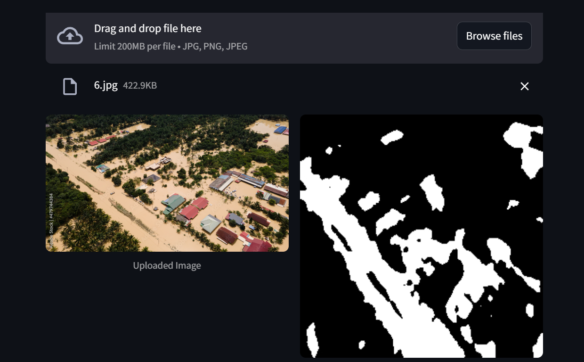

# 🛰️ Satellite Flood Detection AI
Check out the Live Demo Video: https://youtu.be/qycIp38p5C4


A Deep Learning application that detects water bodies and flood zones in satellite imagery using Semantic Segmentation. This project implements a custom **U-Net architecture** in PyTorch and features an interactive web interface built with **Streamlit** for real-time inference.


*Left: Original Satellite Image | Right: AI Predicted Flood Mask*

## 📋 Table of Contents
- [Overview](#overview)
- [Dataset](#dataset)
- [Tech Stack](#tech-stack)
- [Installation](#installation)
- [Usage](#usage)
- [Model Architecture](#model-architecture)

## 🌊 Overview
Flood mapping is critical for disaster response, but manual analysis of satellite imagery is slow. This project automates the process using Computer Vision.
- **Goal:** Classify every pixel in a satellite image as either "Water" or "Land".
- **Method:** Trained a U-Net Convolutional Neural Network from scratch.
- **Outcome:** Achieved stable segmentation with Binary Cross Entropy Loss.

## 📂 Dataset
The model was trained on the **Flood Area Segmentation Dataset**.
- **Source:** [Kaggle - Flood Area Segmentation](https://www.kaggle.com/datasets/faizalkarim/flood-area-segmentation)
- **Content:** High-resolution RGB satellite images with corresponding binary water masks.
- **Preprocessing:** Images were resized to 256x256 and normalized before training.

## 🛠️ Tech Stack
- **Deep Learning:** PyTorch, Torchvision
- **Architecture:** U-Net (Encoder-Decoder with Skip Connections)
- **Web App:** Streamlit
- **Image Processing:** PIL (Pillow), NumPy
- **Visualization:** Matplotlib

## ⚙️ Installation

1. **Clone the repository:**
   ```bash
   git clone https://github.com/anadya-s/Satellite-Flood-Detection-UNet.git
   cd Satellite-Flood-Detection-UNet

```

2. **Install dependencies:**
```bash
pip install -r requirements.txt

```


## 🚀 Usage

### Running the Web App

To use the interactive dashboard and test the model on new images:

```bash
streamlit run app.py

```

This will open a local server (usually `http://localhost:8501`) where you can drag and drop satellite images to see the flood detection in real-time.

### Training the Model

If you want to retrain the model from scratch, open `train.ipynb` in Jupyter Notebook.

* Note: You will need to download the dataset from Kaggle and place it in the correct directory.

## 🧠 Model Architecture

The project uses **U-Net**, a fully convolutional network designed for biomedical image segmentation.

* **Encoder (Downsampling):** Captures context using convolutional blocks and MaxPooling.
* **Decoder (Upsampling):** Enables precise localization using Transpose Convolutions.
* **Skip Connections:** Concatenates features from the encoder to the decoder to preserve spatial details lost during pooling.

## 👤 Author

**Anadya Shekhar**

* LinkedIn: [Anadya Shekhar](https://www.linkedin.com/in/anadya-shekhar)


---

*If you find this project useful, please give it a star! ⭐*

```

```
